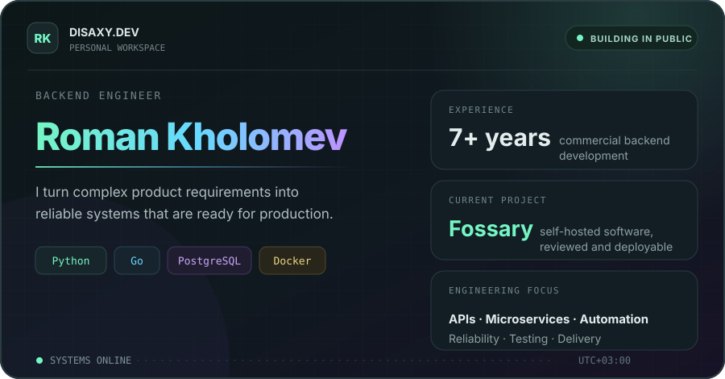
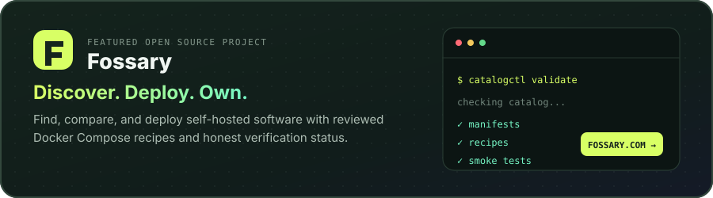

  

  <a href="https://disaxy.dev"><strong>disaxy.dev</strong></a>&nbsp;&nbsp;·&nbsp;&nbsp;
  <a href="https://fossary.com">Fossary</a>&nbsp;&nbsp;·&nbsp;&nbsp;
  <a href="https://t.me/disaxy">Telegram</a>&nbsp;&nbsp;·&nbsp;&nbsp;
  <a href="mailto:disaxy@gmail.com">Email</a>

I build backend systems from API design to production delivery. My work spans microservices, integrations, data-intensive services, infrastructure automation, and the engineering practices that keep them reliable.

**Core:** `Python` `Go` `Django` `FastAPI` `PostgreSQL` `Redis` `RabbitMQ` `Kafka` `Docker` `Kubernetes`

## Building now

Fossary is an open-source catalog for finding and deploying self-hosted software. It combines discovery, comparison, server matching, and reviewed Docker Compose recipes with transparent verification history.

[Visit fossary.com](https://fossary.com) · [Explore the public catalog](https://github.com/fossaryhq/catalog) · [Contribute](https://github.com/fossaryhq/catalog/issues)

## What I care about

- Designing clear APIs and maintainable service boundaries
- Making reliability and observability part of the implementation
- Automating repetitive work without hiding important decisions
- Shipping useful open-source products, not just experiments

## Contact

[disaxy.dev](https://disaxy.dev) · [Telegram](https://t.me/disaxy) · [disaxy@gmail.com](mailto:disaxy@gmail.com)

<strong>Русская версия</strong>

### Обо мне

Backend-разработчик с 7-летним опытом. Проектирую и запускаю микросервисы, API, интеграции, data-intensive сервисы и автоматизацию инфраструктуры. Уделяю особое внимание надёжности, наблюдаемости и качеству production-систем.

**Основной стек:** `Python` `Go` `Django` `FastAPI` `PostgreSQL` `Redis` `RabbitMQ` `Kafka` `Docker` `Kubernetes`

### Над чем работаю сейчас

**[Fossary](https://fossary.com)** - open-source каталог для поиска и развёртывания self-hosted приложений. Он объединяет подбор и сравнение приложений, проверку совместимости с сервером, проверенные Docker Compose-рецепты и прозрачную историю проверок.

[Личный сайт](https://disaxy.dev) · [Открыть Fossary](https://fossary.com) · [Посмотреть каталог](https://github.com/fossaryhq/catalog) · [Telegram](https://t.me/disaxy) · [Email](mailto:disaxy@gmail.com)

