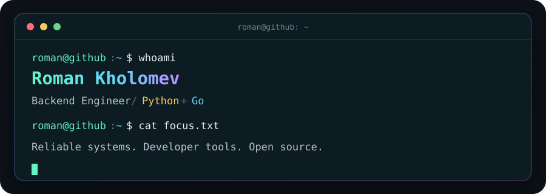

<div align="center">
  
</div>

```console
$ cat about.txt
Backend engineer with 7 years of experience building commercial systems,
microservices, APIs, integrations, and business automation.

$ stack --primary
Python · Go · Django · FastAPI · PostgreSQL · Redis · RabbitMQ · Kafka
Docker · Kubernetes · GitHub Actions · GitLab CI · Pytest · OpenTelemetry

$ cat principles.txt
Ship reliable software. Test what matters. Keep complexity under control.
```

## `./projects --featured`

### [Fossary](https://fossary.com)

**Discover. Deploy. Own.**

An open-source catalog for finding and deploying self-hosted software. Fossary brings application discovery, comparison, server matching, and reviewed Docker Compose recipes into one place.

```console
$ catalogctl validate ./catalog/apps
checking manifests and recipes...
✓ Schema valid
✓ Environment documented
✓ Smoke test metadata valid
✓ Catalog valid
```

[Explore Fossary](https://fossary.com) · [Contribute to the catalog](https://github.com/fossaryhq/catalog)

## `./contact`

[Telegram](https://t.me/disaxy) · [GitHub](https://github.com/Disaxy)

<details>
<summary><strong>Русская версия</strong></summary>

### Обо мне

Backend-разработчик с 7-летним опытом создания коммерческих систем, микросервисов, API, интеграций и автоматизации бизнес-процессов.

Основной стек: **Python, Go, Django, FastAPI, PostgreSQL, Redis, RabbitMQ, Kafka, Docker и Kubernetes**. В работе уделяю особое внимание надёжности production-систем, тестированию и контролю сложности.

### Главный проект

**[Fossary](https://fossary.com)** - open-source каталог для поиска и развёртывания self-hosted приложений. Он объединяет подбор и сравнение приложений, проверку совместимости с сервером и проверенные Docker Compose-рецепты.

[Открыть Fossary](https://fossary.com) · [Помочь каталогу](https://github.com/fossaryhq/catalog) · [Написать в Telegram](https://t.me/disaxy)

</details>

```console
roman@github:~$ _
```
